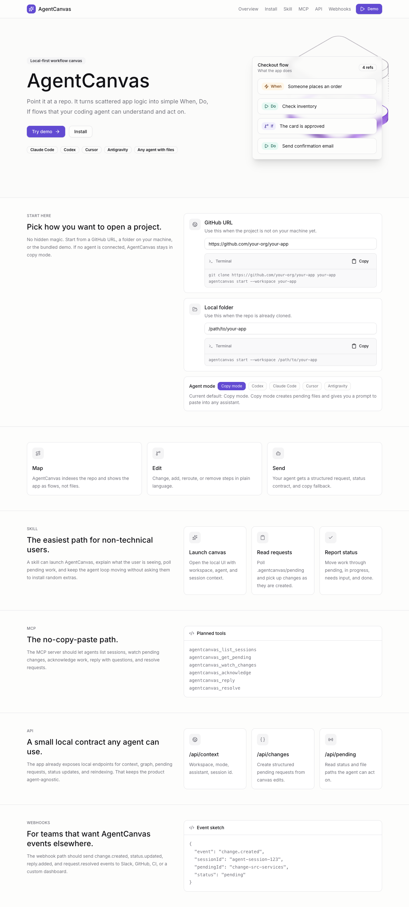
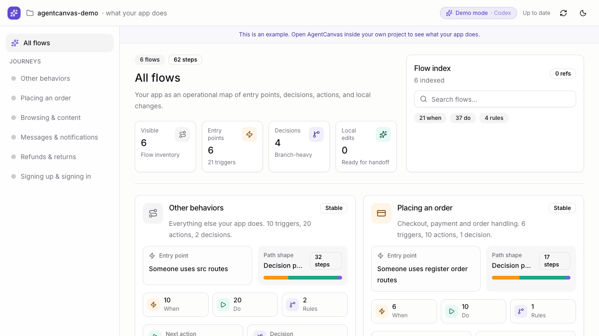

# AgentCanvas

AgentCanvas is a local visual workspace for giving coding agents better work.

It looks at a repo, turns the important app flows into a plain-language canvas,
lets you mark what should change, then turns that into a clear request a coding
agent can actually implement.

The point is simple: stop handing agents vague chat messages and hoping they
guess correctly. AgentCanvas makes the work visible, copyable, and trackable.

## What It Does

AgentCanvas helps with the messy part between "this flow is wrong" and "make
this exact code change."

- It indexes your repo.
- It shows the main workflows, routes, actions, services, jobs, and app surfaces.
- It lets you create small change requests from the canvas.
- It writes those requests into `.agentcanvas/pending/`.
- A coding agent reads the request, implements it, verifies it, updates status,
  and re-indexes the workspace.

AgentCanvas is not trying to replace Codex, Claude Code, Cursor, Antigravity, or
any other coding agent. It is the layer that makes the task clear before an
agent starts editing.

## Screenshots

Landing mode:



Demo mode:



## How It Works

The core loop is intentionally small:

1. Point AgentCanvas at a workspace.
2. It writes a local index to `.agentcanvas/workflow.ir.json`.
3. The browser shows a canvas built from that index.
4. You describe the change you want.
5. AgentCanvas creates a Markdown brief and a JSON brief in
   `.agentcanvas/pending/`.
6. A coding agent picks up the request.
7. The agent marks the request `in_progress`, `needs_input`, `blocked`, or
   `done`.
8. The agent re-indexes after implementation so the canvas reflects the latest
   code.

Canvas edits do not directly patch your app. They become requests first. That is
the safety boundary.

## Install

From this repo:

```bash
cd /Users/ojima/Desktop/experiments/agentcanvas
python3 -m pip install -e .
```

Check the CLI:

```bash
agentcanvas --help
```

You can also run it directly from the source checkout:

```bash
python3 -m agentcanvas --help
```

## Run It

Start with the landing page when you do not have a workspace selected yet:

```bash
agentcanvas start --port 8765
```

Try the bundled demo project:

```bash
agentcanvas start --demo --port 8765
```

Use a real workspace:

```bash
agentcanvas index --workspace /path/to/your/project
agentcanvas start --workspace /path/to/your/project --port 8765
```

Open the printed URL, usually:

```text
http://127.0.0.1:8765
```

If an agent is launching AgentCanvas, it can pass its name and session id:

```bash
agentcanvas start --workspace /path/to/your/project --agent codex --session-id <session-id>
```

## Landing And Demo Mode

Landing mode is what you see when no workspace is selected. It should make the
next step obvious: open a real workspace or try the demo.

Demo mode uses a bundled sample app, but it still runs through the real indexer,
server, pending-request files, and status loop. The UI should always make demo
mode obvious so nobody thinks the sample app is their own repo or that a live
agent is connected when it is not.

See [docs/demo-mode.md](docs/demo-mode.md) for the product rules.

## Workspace Mode

Workspace mode is the real use case.

AgentCanvas writes all local state under the selected repo:

```text
<workspace>/.agentcanvas/workflow.ir.json
<workspace>/.agentcanvas/pending/*.md
<workspace>/.agentcanvas/pending/*.json
```

The Markdown file is the human-readable task. The JSON file is the structured
version for tools and agents.

## Send Changes To A Coding Agent

An agent can list pending requests:

```bash
agentcanvas pending --workspace /path/to/your/project
```

When it starts:

```bash
agentcanvas status --workspace /path/to/your/project <pending-id> --status in_progress
```

When it needs the user before it can safely continue:

```bash
agentcanvas status --workspace /path/to/your/project <pending-id> --status needs_input --note "Should this apply only to checkout, or to every order flow?"
```

When it is blocked:

```bash
agentcanvas status --workspace /path/to/your/project <pending-id> --status blocked --note "I need access to the missing service config before continuing."
```

When it has implemented and verified the change:

```bash
agentcanvas index --workspace /path/to/your/project
agentcanvas status --workspace /path/to/your/project <pending-id> --status done --note "Implemented and verified."
```

The important part is that status comes from the agent or CLI. The browser
should not pretend work happened.

## The Clarification Loop

Agents should not guess when the request is unclear.

Before execution, the agent should read the pending Markdown and JSON, check the
current workspace state, and decide whether the request is specific enough. If
not, it should mark the request `needs_input` with one clear question. That
question flows back to the user instead of becoming a random code change.

That loop matters because the product is not just "send work to an agent." It is
"send clear work, let the agent ask before it edits, then track what actually
happened."

## Copy-Prompt Fallback

Copy mode is a core feature, not a backup plan.

If no live agent or adapter is connected, AgentCanvas still creates the pending
files and shows a clean prompt the user can paste into any coding agent. The
prompt includes the workspace, pending file paths, acceptance details, status
commands, and the reminder to test and re-index.

This keeps AgentCanvas useful before deeper integrations exist.

## Agent-Agnostic By Design

AgentCanvas should work with any coding agent.

Current and planned integration paths:

- **Skill**: install `skill/agentcanvas/` into an agent that supports skills.
- **Local API**: the browser/server path uses `/api/context`, `/api/graph`,
  `/api/pending`, `/api/changes`, `/api/status`, and `/api/reindex`.
- **MCP**: planned tool path for agents that prefer structured tools over shell
  commands.
- **Webhooks**: planned callback path for outside tools to report status,
  questions, or completion.
- **Copy prompt**: always available, even with no adapter installed.

The file contract stays the same across all of them: `.agentcanvas/` is the
shared source of truth.

See [docs/adapters.md](docs/adapters.md) for adapter notes and prompt snippets.

## Language And Monorepo Support

AgentCanvas now has a broader core indexing layer.

Built-in MVP language modules:

- JavaScript and TypeScript
- Python
- Go
- PHP/Laravel
- Ruby/Rails
- Dart/Flutter
- Swift
- Kotlin

The goal is not to perfectly compile every language on day one. The goal is to
collect grounded facts with file paths and evidence, then let the projection
layer turn those facts into a canvas a person can read.

For monorepos, AgentCanvas keeps app surfaces separate instead of flattening
everything into one generic graph. A repo with `apps/customer-web`,
`apps/admin`, and `services/api` should keep those surfaces visible.

See [docs/language-support.md](docs/language-support.md) for the language module
contract.

## Projection

AgentCanvas can use an LLM or coding agent to turn source facts into a cleaner
human canvas, but the package does not call a model by itself.

Validate a projected canvas first:

```bash
agentcanvas apply-query --workspace /path/to/your/project --query canvas-query.json --dry-run
```

Write only after validation passes:

```bash
agentcanvas apply-query --workspace /path/to/your/project --query canvas-query.json
```

See [docs/projection.md](docs/projection.md).

## Safety Rules

- AgentCanvas creates requests before source code changes.
- Agents should read the request before editing.
- Agents should ask with `needs_input` when the request is unclear.
- Agents should run the closest relevant test or smoke check.
- Agents should re-index after implementation.
- Agents should not mark a request `done` until the work is verified.
- Migrations, seeds, deploys, and destructive commands still need explicit user
  permission.

## Development

Run tests:

```bash
python3 -m unittest discover
```

Useful local loop:

```bash
python3 -m pip install -e .
agentcanvas index --workspace examples/sample-js-app
agentcanvas start --workspace examples/sample-js-app --port 8765
python3 -m unittest discover
```

Keep generated workspace state out of source commits unless it is an intentional
fixture:

```text
.agentcanvas/
```
